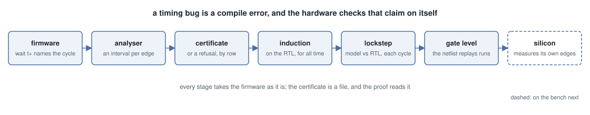
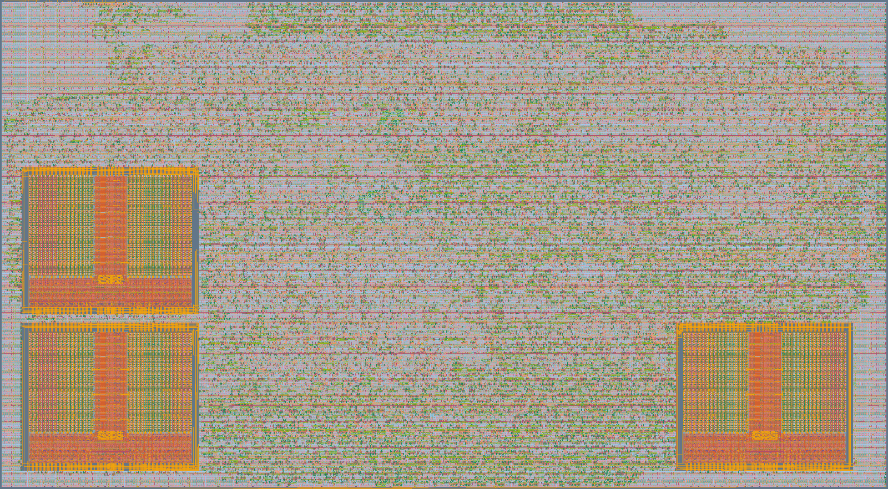
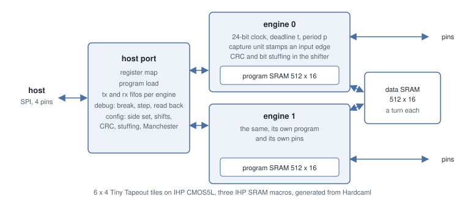

# protocol-emulator

An entry for Jane Street's protocol emulator ASIC competition, on IHP CMOS5L through
Tiny Tapeout, written in Hardcaml.



Two small cores bit-bang the pins from firmware. A 24-bit clock, a deadline register `t`
and a period `p` make the timing explicit: `wait t+` releases on the exact cycle and moves
the deadline on by one period, so a frame never drifts. An analyser bounds the time of
every edge and sample in a program by abstract interpretation and refuses a program that
can miss a deadline. What it certifies is then proved of the hardware by induction, for
every input and every host, so a firmware that assembles is a firmware whose timing the
RTL is proven to keep.

```
    set p, 434
    set pins, 1
idle:
    wait tx
    pull
    set x, 7
    mov t, now
    set pins, 0
    add t, p
bit:
    wait t+
    out pins, 1
    jmp x--, bit
    wait t+
    set pins, 1
    wait t
    jmp idle
```

## What is proven

Every firmware in the library, as the analyser certifies it: how many words, how many
deadline waits, the worst slack at any of them in cycles, and what the certificate rests
on. The table is an expect test, `test/test_certified.ml`, so it cannot go stale.

```
firmware           words  deadline  slack  assumes
uart_tx               15         3      4
uart_tx16             15         3     12
uart_tx_host_rate     17         3    430  period 434, no wrap
uart_rx               21         2      3  one edge before capture, no wrap
spi_master            16         3      4
spi_slave              6         0      -
i2c_master            83        25      2  no wrap
i2c_slave             72         0      -
i2c_logger            73        25      1
usb_tx                65        11     16  period 32
usb_rx                29         2      8  period 32, one edge before capture, no wrap
usb_device           470        54      6  period 32, one edge before capture, no wrap
edge_meter            12         2      6
ws2812                32         4      0  no wrap
ethernet              24         1  63987  period 64000
one_wire              48        15    295  period 300
ps2                   65        12    992  period 1000
jtag                  15         3      0
```

Each certificate is checked on the RTL by SymbiYosys, as an invariant proved by
induction that holds for all time and not only to a depth, with the program in the SRAM
and the pins and the host free. All 18 close. Each run is followed by one that adds a
claim false in every run, which has to fail, so the invariant is known to be one some
state satisfies.

```
make -C formal inductive_certificates
```

The assumptions are the whole list. A period is the bit period the host loads into `p`.
One edge before capture is what a start bit gives a receiver that arms in time. No wrap
says the core is within 84 ms of its deadline and of the edge it last captured, which is
half of what 24 bits tell apart and the bound the hardware's own compare keeps; the
firmware that needs it either waits on the host for as long as the host likes or anchors
on a captured edge on a line that may stay idle.

Alongside the certificates, `formal/` proves that issue timing depends on nothing but the
delay field, that the host talking never reaches the pins however it talks, and that the
fifos keep their order, each with weakened copies that have to fail. Every firmware also
runs against a protocol model in lockstep with the hardware, cycle for cycle, and the
hardened netlist replays those runs at gate level.

## The die



6 x 4 tiles at 50 MHz. The two program SRAM macros are on the left, the shared data
SRAM on the right, and the two engines, the host port and the debug port in between.



The host talks SPI on `ui[2:0]` and `uo[0]`: a register map for control, configuration and
program load, and two fifos per core for data. Each core's program lives in its own IHP
SRAM macro; a third holds data the two share, a turn each.

## Layout

- `src/` the ISA, a cycle-accurate model that serves as the spec, the assembler, the
  decoder, the engine, the host port and the top level. `analyser.ml` bounds the time of
  every pin edge and sample by abstract interpretation, and `generate.exe assemble`
  refuses firmware that can miss a deadline.
- `test/` expect tests. `firmware.ml` holds UART, SPI and I2C masters and slaves and a
  low speed USB device that enumerates as a keyboard and mouse; `ws2812.ml`,
  `one_wire.ml`, `ps2.ml`, `jtag.ml` and `ethernet.ml` (10BASE-T transmit of a UDP
  datagram) hold more. `certified.ml` lists them with what each certificate assumes. Each
  runs against a protocol model, in lockstep with the hardware, and inside its timing
  analysis. `test.py` drives the generated Verilog with cocotb through the Python host
  library.
- `test/certify/` writes each certificate as SystemVerilog properties of the RTL for
  `formal/`.
- `formal/` the SymbiYosys proofs above.
- `python/` the host library, with a debugger (breakpoint, step, registers) and a
  10BASE-T frame builder, and demo scripts for the dev board.

## Build

```
opam install . --deps-only --with-test --locked
dune build @runtest
dune exec -- bin/generate.exe top -sram -engines 2 > src/protocol_emulator.v
make -C formal
```

Hardening uses the Tiny Tapeout flow: `tt/tt_tool.py --create-user-config --ihp` then
`--harden --ihp`, with a LibreLane plugin that runs the power stripes over the SRAM pins.
