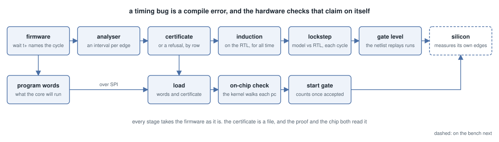
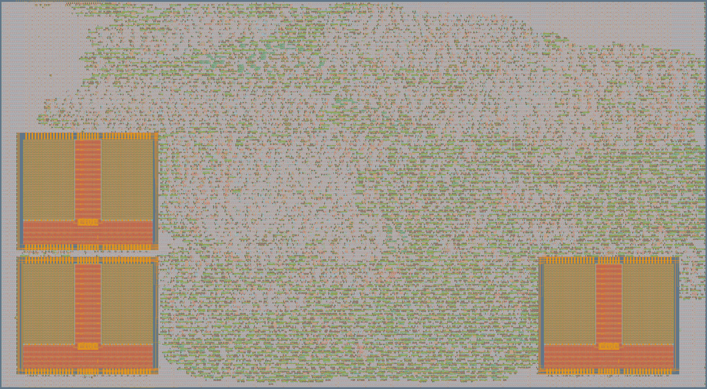

# protocol-emulator

An entry for Jane Street's protocol emulator ASIC competition, written in Hardcaml and
built on IHP CMOS5L through Tiny Tapeout, in 6 x 4 tiles at 50 MHz.



Two small cores bit-bang the pins from firmware. The timing is explicit: there is a 24-bit
clock, a deadline register `t` and a period `p`. `wait t+` releases on the exact cycle and
moves the deadline on by one period, so a frame never drifts. An analyser certifies each
program's timing, and a small kernel, proved sound against the RTL, refuses any program
whose certificate it cannot check. So if a firmware assembles with the timing check on,
the RTL is proven never to miss one of its deadlines, under the assumptions below.

| | | Source |
|---|---|---|
| Process | IHP SG13CMOS5L through Tiny Tapeout, 6 x 4 tiles | `info.yaml`, `.github/workflows/gds.yaml` |
| Clock | 50 MHz | `info.yaml` |
| Cores | 2 cores, 3 IHP 512 x 16 SRAM macros: a program memory each and a data memory they share | `src/protocol_emulator.v` |
| Pins | 4 for the host's SPI, 5 in, 7 out, 8 bidirectional, and 8 wires between the cores | `info.yaml`, `src/isa.ml` |
| Hardened | 23,883 standard cells at 49.7% utilisation, setup slack +4.009 ns at the slow corner, precheck clean | gds run [36922636022](https://github.com/MarcosAsh/protocol-emulator/actions/runs/36922636022) |
| Firmware | 22 library firmwares the kernel accepts | `test/test_kernel.ml` |
| Proved | a program the kernel accepts never misses a deadline on each core's RTL, under the assumptions below | `formal/phase_table.sby` |
| Board | the RTL on an Icepi Zero (ECP5 FPGA) passed the self-timing demo on 2026-10-01, no silicon yet | `python/demo_self_timing.py` |

## From source to pins

`test/uart_tx.asm` is a UART transmitter at 16 cycles a bit. Give its `out` 13 cycles of
delay and the bit loop no longer fits in a period: the assembler says where and exits 1.
With 12 it passes, at slack 0. The commands need the OxCaml switch, `5.2.0+ox`.

```
$ dune exec -- bin/generate.exe assemble -listing test/uart_tx.asm
...
15 words, 3 deadline waits, worst slack 12
kernel: accepted, so no deadline is missed by the step lemma
$ sed 's/out pins, 1/out pins, 1 [13]/' test/uart_tx.asm > late.asm
$ dune exec -- bin/generate.exe assemble late.asm
late.asm: 3 of 3 deadline waits may be missed
  8  wait t+                      phase -13..?  slack ?..13  MAY MISS
...
```

The host loads the words, `test/uart_tx.hex`, over SPI with `python/protocol_emulator.py`:

```python
host = demo_board.host()
host.configure(DEFAULT_CONFIG)  # set and out base at pin 5, which is uo[1]
host.load(hex_words(open("uart_tx.hex").read()))
host.push([0x55, 0xA3])
host.start()
```

On the Tiny Tapeout demo board that sends 0x55 and 0xA3 as two frames on `uo[1]`. No Tiny
Tapeout board has run it yet. `make -C test COCOTB_TEST_FILTER=test_uart_over_spi` runs it
under cocotb.

## What is proved

- One theorem covers every program: if the kernel accepts it, it never misses a deadline.
  `src/kernel.ml` is a checker you can read in one sitting. `formal/phase_step.sv` with a
  SAT query in `test/test_kernel.ml` proves the theorem, and so does
  `formal/phase_table.sby`.
- The hardened netlist equals the RTL for all time from all flops 0 (`netlist_equiv` job).
- When and how the host talks reaches the pins only through the program's own fifo
  waits and tests, or a fault. Like the other lemmas in `formal/`, it has weakened copies
  that must fail (`make -C formal teeth`).
- The kernel accepts all 22 library firmwares (UART, SPI, I2C, USB, WS2812, 1-Wire, PS/2,
  JTAG, CAN, 10BASE-T, DShot600, SENT, CEC). `test/test_certified.ml` lists each with its
  slack and assumptions.
- hardcaml_hobby_boards' `Uart.Tx`, compiled to firmware, drives the core's pin as the
  circuit drives its line, 4 cycles later, at 4 clocks a bit, for bytes at least 4 cycles
  after ready (`make -C formal fsm_miter`).
- Two engines composed: uart_tx on engine 0 to uart_rx on engine 1 over an on-chip wire,
  10 cycles a bit, is proved for all time: engine 1 pushes the low byte of each word
  engine 0 pulled, once a frame (`formal/link.sby`, the `link` job).
- `Self_check.checker`, firmware that checks a pin's edges against rows from the kernel:
  for one set of edges on pin 0, rows at 0, on one engine with a private data memory (not
  the chip's shared one), its program and rows as ROMs and the host idle, no irq, no halt
  and none of its own deadlines missed until the line leaves its rows, for all time
  (`formal/self_check_clean.sby`, witness checked by cake_lpr in the `witness` job). Its
  irq by the contract's deadline after a break is proved only for 116 cycles from the
  clear, which reach the first frame's deadline only if the first fall comes by about
  cycle 22 (`formal/self_check.sby`).
- Power-up is deterministic: two copies of the chip from any two states of their flops and
  fifos, with the same words in their SRAMs, reset at the first edge and given the same
  pins, drive the same pins (`formal/powerup.sby`).
- Each UNSAT in the SAT proofs is checked by cake_lpr, an LRAT checker verified in HOL4.
  Each SAT answer counts only once its model satisfies every clause the solver was given.

## What is not proved

- Trusted: Yosys, SymbiYosys, boolector, ABC, cake_lpr, Certifaiger and the aiger tools
  for the witnesses, hardcaml_verify's translation of gates into clauses, `Bits` agreeing
  with `Comb_gates`, stated facts of arithmetic modulo 2^24, IHP's behavioural SRAM model,
  the self-check's contract (`test/self_check_contract.ml`), and the PDK's models and the
  flow's timing analysis.
- The theorem assumes that:
  - every write to `p` other than a `set` leaves the checked period
  - a receiver's capture pin is at the other level at `capture_arm` and, once at the
    captured level, stays there until the wait releases
  - the core runs the words and configuration the kernel checked, with zeros past the
    program
  - the host loads and starts a core only while halted
  - the configuration is fixed from power-on, the only reset
  - side-set count is at most 2
- The theorem says nothing of the underflow and overflow a slow host can cause.
- Tested, not proved:
  - the core against its model beyond the decoder, deadline compare, pin rotation and
    data path values, on every library firmware and on random programs
  - which host words the pins carry, for all but five transmitters
  - the protocols, against models we wrote
  - USB enumeration, which the board does in `python/usb_board.py`
- Nothing has run on silicon yet. On an Icepi Zero FPGA (ECP5, 48 MHz) running the chip's
  RTL, `python/demo_self_timing.py` passed on 2026-10-01: engine 1 stamped all 52 edges of
  engine 0's `Jane St!` at 9600 baud on the predicted cycles, quiet and with the host
  flooding SPI with reads. The USB keyboard (`python/demo_usb.py`) does not work there
  yet.

## What the checks found

The tests kill 111 of 114 valid mutants of the engine, decoder, pins and host port
(mutation run 36642527804, 2026-09-29). The other 3 are equivalent, see
`test/mutation_allow.txt`. Counted on 2026-09-30, of 13 bugs fixed in commits of their
own, model tests found 3, the analyser's soundness check 3, AI review 3, proofs 2, the
analyser 1 and a mutant 1, among them a showahead `Fifo` holding one word over its
capacity (mutant, a67aa23), a stale power-up word at an empty rx fifo's head (proof,
ae5e91d) and an `add t, x` after a spent `jmp x--` certified 65536 cycles wrong (soundness
check, 99d55ee).

Eight held-out protocols, none of them in the firmware library, are sealed in
`test/heldout.sha256`, the SHA-256 of a salted list committed on 2026-10-02. When the list
is opened in November, an agent writes each one from its public spec, then the kernel
checks it and one of sigrok's decoders reads it from simulation. Every result goes here,
failures included.

## AI-assisted verification

Agents write firmware, models, checkers and proof harnesses, and review them. Each output
passes a gate, and a finding counts only with a reproducer that fails on the code. Not
every gate is apart from the agents: one agent wrote the DShot600, SENT and CEC firmware
and their decoders, and an agent wrote the self-check's contract (4ea99d7), which is
trusted. The method is not new. Counts are per finding as filed, so one bug can count
twice.

| AI does | Gate | Result | Against it |
|---|---|---|---|
| writes DShot600, SENT and CEC firmware from the specs | the kernel, then a decoder per line | 4 of 8 drafts refused, all SENT: 1 by the assembler, 3 by the kernel, 2 of them drafts the analyser had passed (`test/test_sent.ml`) | the kernel accepted 3 protocol bugs it cannot see. A decoder caught 1 and review 2 |
| attacks our claims, 10 rounds on 2026-09-30 | a reproducer, then two refuters for HIGH and MEDIUM | 76 confirmed (9 HIGH, 18 MEDIUM) and 44 rejected. All HIGH and MEDIUM were in tested code, none in proved | self-check passed 1000 quickcheck trials with 8 holes. Earlier rounds, uncounted and with no refute step, found 37 overclaims in proof work |
| finds a bug in someone else's code | a bench capture beside the RP2040's I2C block, which holds a start 4.42 us | pico-examples pio/i2c holds a start 3.125 us where I2C needs 4.0, at all 1356 starts captured. Filed as [#796](https://github.com/raspberrypi/pico-examples/issues/796) | the checker that found it had 3 HIGH soundness bugs in each of two rounds before it landed |
| writes a miner that proposes invariants for the self-check's proof (`test/certify/write_self_check.ml`) | 12-step induction, dropping claims it cannot keep, with the witness checked by Certifaiger and cake_lpr | 1957 claims from 2000 simulated runs, 6 dropped. With the rest, 7 core invariants and the reachable keys, induction proves the for-all-time self-check claim above | nine earlier sets failed. The 6 drops rest on unchecked counterexamples, from a loop not in the repo |
| reviews code with 27 planted bugs, blind | the reproducer fails on the planted tree, passes on the clean one | 22 found. It also found 10 real bugs on main, each since fixed with a test (1754480 to 3c39091, 7e9626f, b042b1e), none touching a proved claim | the planted tree's test outputs, regenerated from the bugs, show some hardware-model mismatches, so 22/27 is an upper bound |

## Build

Needs the OxCaml switch, and OSS CAD Suite and cocotb for `formal/` and `test/`. Without
OCaml, the [playground](https://marcosash.github.io/protocol-emulator/playground/) shows the
kernel accept or refuse pasted firmware, and the [latest release](https://github.com/MarcosAsh/protocol-emulator/releases/latest)
has `generate-linux-x86_64` (Ubuntu 24.04 or newer).

```
opam install . --deps-only --with-test --locked
make -C formal sat_tools   # cadical and cake_lpr; put formal/sat_tools/bin on PATH
dune build @runtest
dune exec -- bin/generate.exe top -sram -engines 2 > src/protocol_emulator.v
make -C formal             # hours; CI runs the long proofs in jobs of their own
```

`make -C test COCOTB_TEST_MODULES=test_demo` runs the self-timing and keyboard demos with
no board in about 6 minutes. Each claim's last green run in CI is on the
[results page](https://marcosash.github.io/protocol-emulator/results/).

To harden, clone TinyTapeout/tt-support-tools, branch `ihp-sg13cmos5l`, into `tt/`, then
`tt/tt_tool.py --create-user-config --ihp` and `--harden --ihp`. Gds run 36922636022, on
this Verilog, signs off with setup slack +4.009 ns at the slow corner, at 49.7%
utilisation. The picture is that run's die by RTL module, drawn by `demo/die.py` from its
`GDS_logs` artifact. 1,873 of 1,883 flops map by RTL line and net name. Each gate goes with
the nearest flop it feeds, which gets 97.9% of gates right on the RTL synthesised a module
at a time (`--check`).


