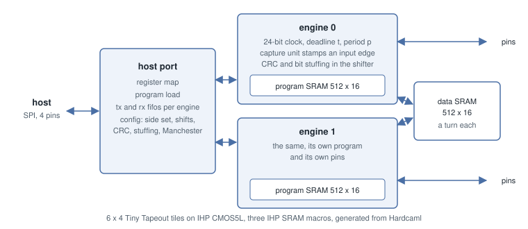

# protocol-emulator

An entry for Jane Street's protocol emulator ASIC competition, written in Hardcaml and
built on IHP CMOS5L through Tiny Tapeout.


Two small cores bit-bang the pins from firmware. The timing is explicit: there is a 24-bit
clock, a deadline register `t` and a period `p`. `wait t+` releases on the exact cycle and
moves the deadline on by one period, so a frame never drifts. An analyser works out when
every edge and sample in a program can happen, by abstract interpretation, and refuses
any program that could miss a deadline. A small kernel, proved sound against the RTL,
checks what it certifies. So if a firmware assembles with the timing check on, the RTL is
proven never to miss one of its deadlines, under the few assumptions listed below.

```
    wait tx
    pull
    mov p, osr
    set pins, 1
idle:
    wait tx
    pull
    set x, 7
    mov t, now
    set pins, 0
    add t, p
bit:
    wait t+
    out pins, 1
    jmp x--, bit
    wait t+
    set pins, 1
    wait t
    jmp idle
```

## What is proven

Here is every firmware in the library as the analyser certifies it: how many words it
has, how many deadline waits, the worst slack at any of them in cycles, and what the
certificate rests on. The table is an expect test, `test/test_certified.ml`, so it can't
go stale.

```
firmware           words  deadline  slack  assumes
uart_tx               15         3      4
uart_tx16             15         3     12
uart_tx_host_rate     17         3    430  period 434, no wrap
uart_rx               19         2      7  one edge before capture, no wrap
spi_master            16         3      4
spi_slave              6         0      -
i2c_master            83        25      5  no wrap
i2c_slave             72         0      -
i2c_logger            73        25      1
usb_tx                65        11     16  period 32
usb_rx                29         2      8  period 32, one edge before capture, no wrap
usb_device           470        54      6  period 32, one edge before capture, no wrap
edge_meter            12         2      6
ws2812                32         4      0  no wrap
ethernet              24         1  63987  period 64000
one_wire              48        15    295  period 300
ps2                   65        12    992  period 1000
jtag                  15         3      0
```

SymbiYosys checks each certificate on the RTL as an invariant proved by induction, so it
holds for all time and not just to some depth. The program sits in a stand-in for the
SRAM, and the pins and the host are left free. All 18 close, and so do the streaming and
stamped variants in `test/certified.ml`, each in a CI job of its own. Each run is followed
by one that adds a claim that is false in every run. That one has to fail, which shows
the invariant isn't vacuous. Induction answers a false claim with a counterexample to the
step and nothing from reset, which SymbiYosys reports as unknown, so either answer counts
and only a pass fails the check.

```
make -C formal inductive_certificates stamped_certificate
```

The slack comes from the analyser under the assumptions in that column. Of those, the
proof on the RTL takes only no wrap, and the theorem for every program below takes the
period and the one edge. What every certificate assumes besides is under "What is not
proved". A period is the bit period the host loads into
`p`. One edge before capture is what a start bit gives a receiver that arms in time. No
wrap says the core is within 84 ms of its deadline and of the edge it last captured.
That is half the 168 ms over which the hardware's own compare reads a deadline the right
way round. Only firmware that can wait indefinitely needs it, either on the host for
as long as the host likes, or on a captured edge from a line that may stay idle.

Alongside the certificates, `formal/` proves that issue timing depends on nothing but the
delay field, that the host talking never reaches the pins however it talks, and that the
fifos keep their order. Each proof comes with weakened copies that have to fail. Every
firmware also runs against a protocol model in lockstep with the hardware, cycle for
cycle, and the hardened netlist runs the cocotb tests and six recorded pin traces at gate
level.

## One theorem for every program

The certificates above are proved one firmware at a time, so a new firmware would need a
new proof. The kernel gets rid of that step. `src/kernel.ml` is a checker you can read in
one sitting. It takes a table with one row per pc, holding the phase to the next
deadline, the period, the loop counters and, for a receiver, the cycles since
`capture_arm`. It accepts the table when every row maps into the rows of the
instructions that can follow it, and no deadline wait is entered late. The kernel's step
is also generated as Verilog, so the proofs use exactly the definition the checker does.

Two proofs close the loop.

- `test/test_kernel.ml` shows with a SAT query, over every instruction word and every
  row, that an accepted table is closed under the kernel's own step.
- `formal/phase_step.sv` shows that for any program in memory, the core moves from one
  entry to the next exactly as the step says, and a deadline wait entered at phase 0 or
  below never faults. It is proved by k-induction on the RTL, with the program, the
  pins, the shared data memory, and the host's data, stops and flushes all left free.
  The same file has weakened copies of the step, and those have to fail.

Put together, if the kernel accepts a program, that program never misses a deadline.
That holds for every program at once, not just the ones in the library. The analyser can
be as clever as it likes. All it has to do is produce a table the kernel accepts, and
nothing it does is trusted.

```
make -C formal phase_step
```

From the analyser's rows the kernel accepts all 18 programs in the library, and
`generate.exe assemble` refuses any firmware it does not accept, unless it is run with
`-no-timing-check`. ws2812 got there by
waiting on each pass of the loop that holds the line low between frames. With one wait
after the loop instead, the phase there depends on how many times the loop ran, and a
row of plain intervals can't say that. So a row can also bound the phase less a multiple
of the loop counter, which is exact where the loop ends, and the kernel accepts that form
too. `test/test_kernel.ml` shows by SAT that no table of plain intervals passes it and
that a table with the extra bound does.

## What is not proved

We trust the tools: Yosys and SymbiYosys with their solvers for the RTL proofs, z3 for
the SAT proofs, and Hardcaml, whose `Bits`, `Comb_gates` and generated Verilog we take to
agree. SAT can't follow a multiplication, so the kernel's SAT proof takes the loop bound
as a free input under a few stated facts of arithmetic modulo 2^24, and rests on them. The proofs put a stand-in with the same registered read in place of the SRAM
macro, and we take the PDK's models and the flow's timing analysis as they are.

The theorem for every program assumes:

- In a firmware checked with a bit period, every write to `p` other than a `set` leaves
  that period in it. For a firmware that loads its period from the host, the host sends
  the period it was checked with.
- In a receiver checked with one capture edge, the capture pin is at the other level when
  `capture_arm` issues. Once it reaches the captured level it stays there until the wait
  for it releases.
- The core runs the words the kernel checked, under the configuration it checked them
  with. The kernel reads the memory past the program as zero, so a program that can run
  off its end needs zeros there.
- The host starts a core and loads its program only while the core is halted.
- The configuration is fixed from power-on, and the chip is reset only then. The host
  port refuses a change while a core runs, but the proof does not cover a change while
  it is halted.
- The side-set count is at most 2, the ISA's range.
- It is proved of one engine with the pins and the data memory free, and those are all
  another engine can reach. So it holds for each engine on the chip. `formal/frame_step.sv`
  shows an engine never moves a pin outside its footprint, but putting two engines'
  certificates together on the chip is not proved yet.

It is about the missed deadline fault. It says nothing about the underflow and overflow
a host that falls behind can cause.

Each firmware's certificate is of one engine that the host starts once. It holds the
host's stop and flush still, fixes the configuration, and reads the data memory as zero. It does not take the period or the one edge above, so for the eight
firmware that name one it shows none of their deadline waits on time. The theorem for
every program is what covers those. Six certificates assume no wrap, so they say nothing
about a run once it has waited longer than 84 ms. The theorem for every program does not
need that.

Nothing above trusts the analyser, since the kernel checks its rows.

Tested, not proved:

- The core against its cycle-accurate model. Only the decoder, the deadline compare and
  the pin rotation are proved equal to their references. The rest runs in lockstep with
  the model on every library firmware and on random programs.
- What the pins carry. Apart from the stamp in `uart_tx_stamped`, the proofs say when a
  pin moves, not what `out` and `mov` put on it.
- The protocols. Each firmware runs against a model of its protocol that we wrote.
- The netlist. It runs the cocotb tests and six pin traces at gate level. No proof says
  it equals the RTL.
- USB enumeration, which the board does, in `python/usb_board.py`.

Nothing has run on a board or on silicon yet.

## The die


6 x 4 tiles at 50 MHz. The two program SRAM macros are on the left, the shared data SRAM
is on the right, and the two engines and the host port sit in between.



The host talks SPI on `ui[2:0]` and `uo[0]`. It gets a register map for control,
configuration and program load, plus two fifos per core for data. Each core's program
lives in its own IHP SRAM macro, and a third macro holds data the two cores share, taking
turns.

## Layout

- `src/` the ISA, a cycle-accurate model that serves as the spec, the assembler, the
  decoder, the engine, the host port and the top level. `analyser.ml` bounds the time of
  every pin edge and sample by abstract interpretation, and `generate.exe assemble`
  refuses firmware that can miss a deadline. `kernel.ml` is the checker above.
- `test/` expect tests. `firmware.ml` holds UART, SPI and I2C masters and slaves, and a
  low speed USB keyboard and mouse whose line and tokens the core handles, while the
  board answers the control requests. `ws2812.ml`,
  `one_wire.ml`, `ps2.ml`, `jtag.ml` and `ethernet.ml` (10BASE-T transmit of a UDP
  datagram) hold the rest. `certified.ml` lists them with what each certificate assumes.
  Each one runs against a protocol model, in lockstep with the hardware, and inside its
  timing analysis. `test.py` drives the generated Verilog with cocotb through the Python
  host library.
- `test/certify/` writes each certificate as SystemVerilog properties of the RTL for
  `formal/`.
- `formal/` the SymbiYosys proofs above.
- `python/` the host library, a 10BASE-T frame builder and demo scripts for the dev
  board.

## Build

```
opam install . --deps-only --with-test --locked
dune build @runtest
dune exec -- bin/generate.exe top -sram -engines 2 > src/protocol_emulator.v
make -C formal
```

Hardening uses the Tiny Tapeout flow: `tt/tt_tool.py --create-user-config --ihp` then
`--harden --ihp`, with a LibreLane plugin that runs the power stripes over the SRAM pins.
